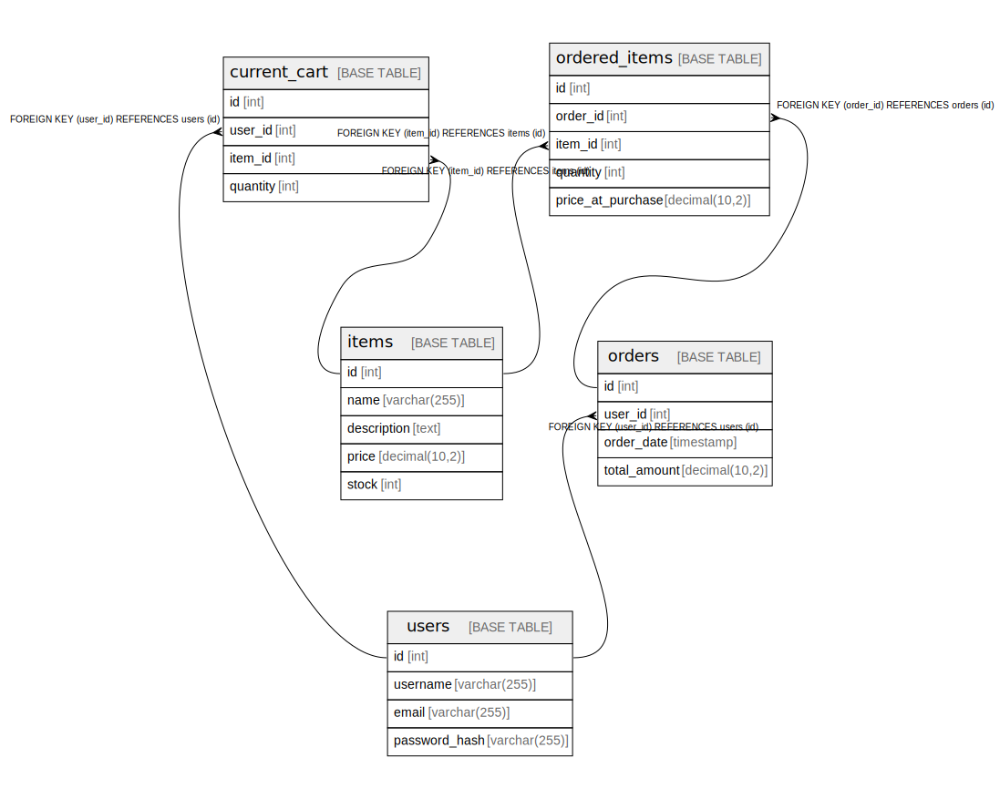

# ecsite-sample-shops

## Viewpoints

| Name | Description |
| ---- | ----------- |
| [注文](viewpoint-0.md) | 注文した商品 |
| [購入前](viewpoint-1.md) | 購入前の商品 |
| [ユーザ](viewpoint-2.md) | ユーザ一覧 |

## Tables

| Name | Columns | Comment | Type |
| ---- | ------- | ------- | ---- |
| [current_cart](current_cart.md) | 4 |  | BASE TABLE |
| [items](items.md) | 5 |  | BASE TABLE |
| [ordered_items](ordered_items.md) | 5 |  | BASE TABLE |
| [orders](orders.md) | 4 |  | BASE TABLE |
| [users](users.md) | 4 |  | BASE TABLE |

## Relations

---

> Generated by [tbls](https://github.com/k1LoW/tbls)
