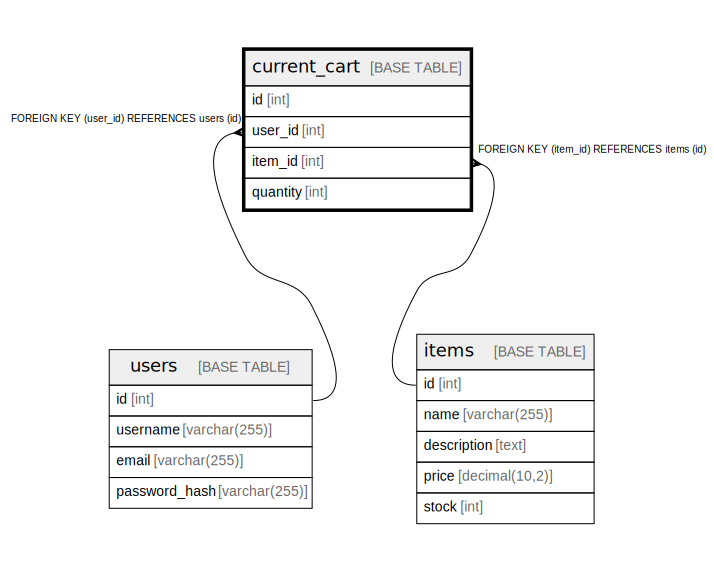

# current_cart

## Description

<details>
<summary><strong>Table Definition</strong></summary>

```sql
CREATE TABLE `current_cart` (
  `id` int NOT NULL AUTO_INCREMENT,
  `user_id` int NOT NULL,
  `item_id` int NOT NULL,
  `quantity` int NOT NULL DEFAULT '1',
  PRIMARY KEY (`id`),
  UNIQUE KEY `user_id` (`user_id`),
  KEY `item_id` (`item_id`),
  CONSTRAINT `current_cart_ibfk_1` FOREIGN KEY (`user_id`) REFERENCES `users` (`id`),
  CONSTRAINT `current_cart_ibfk_2` FOREIGN KEY (`item_id`) REFERENCES `items` (`id`)
) ENGINE=InnoDB DEFAULT CHARSET=utf8mb4 COLLATE=utf8mb4_0900_ai_ci
```

</details>

## Columns

| Name | Type | Default | Nullable | Extra Definition | Children | Parents | Comment |
| ---- | ---- | ------- | -------- | ---------------- | -------- | ------- | ------- |
| id | int |  | false | auto_increment |  |  |  |
| user_id | int |  | false |  |  | [users](users.md) |  |
| item_id | int |  | false |  |  | [items](items.md) |  |
| quantity | int | 1 | false |  |  |  |  |

## Viewpoints

| Name | Definition |
| ---- | ---------- |
| [注文](viewpoint-0.md) | 注文した商品 |
| [購入前](viewpoint-1.md) | 購入前の商品 |

## Constraints

| Name | Type | Definition |
| ---- | ---- | ---------- |
| current_cart_ibfk_1 | FOREIGN KEY | FOREIGN KEY (user_id) REFERENCES users (id) |
| current_cart_ibfk_2 | FOREIGN KEY | FOREIGN KEY (item_id) REFERENCES items (id) |
| PRIMARY | PRIMARY KEY | PRIMARY KEY (id) |
| user_id | UNIQUE | UNIQUE KEY user_id (user_id) |

## Indexes

| Name | Definition |
| ---- | ---------- |
| item_id | KEY item_id (item_id) USING BTREE |
| PRIMARY | PRIMARY KEY (id) USING BTREE |
| user_id | UNIQUE KEY user_id (user_id) USING BTREE |

## Relations



---

> Generated by [tbls](https://github.com/k1LoW/tbls)
