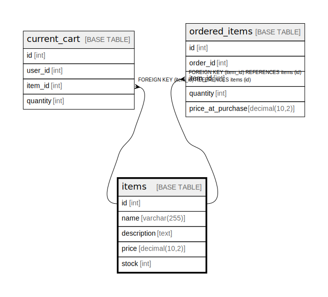

# items

## Description

<details>
<summary><strong>Table Definition</strong></summary>

```sql
CREATE TABLE `items` (
  `id` int NOT NULL AUTO_INCREMENT,
  `name` varchar(255) NOT NULL,
  `description` text,
  `price` decimal(10,2) NOT NULL,
  `stock` int DEFAULT '0',
  PRIMARY KEY (`id`)
) ENGINE=InnoDB DEFAULT CHARSET=utf8mb4 COLLATE=utf8mb4_0900_ai_ci
```

</details>

## Columns

| Name | Type | Default | Nullable | Extra Definition | Children | Parents | Comment |
| ---- | ---- | ------- | -------- | ---------------- | -------- | ------- | ------- |
| id | int |  | false | auto_increment | [current_cart](current_cart.md) [ordered_items](ordered_items.md) |  |  |
| name | varchar(255) |  | false |  |  |  |  |
| description | text |  | true |  |  |  |  |
| price | decimal(10,2) |  | false |  |  |  |  |
| stock | int | 0 | true |  |  |  |  |

## Viewpoints

| Name | Definition |
| ---- | ---------- |
| [購入前](viewpoint-1.md) | 購入前の商品 |

## Constraints

| Name | Type | Definition |
| ---- | ---- | ---------- |
| PRIMARY | PRIMARY KEY | PRIMARY KEY (id) |

## Indexes

| Name | Definition |
| ---- | ---------- |
| PRIMARY | PRIMARY KEY (id) USING BTREE |

## Relations



---

> Generated by [tbls](https://github.com/k1LoW/tbls)
