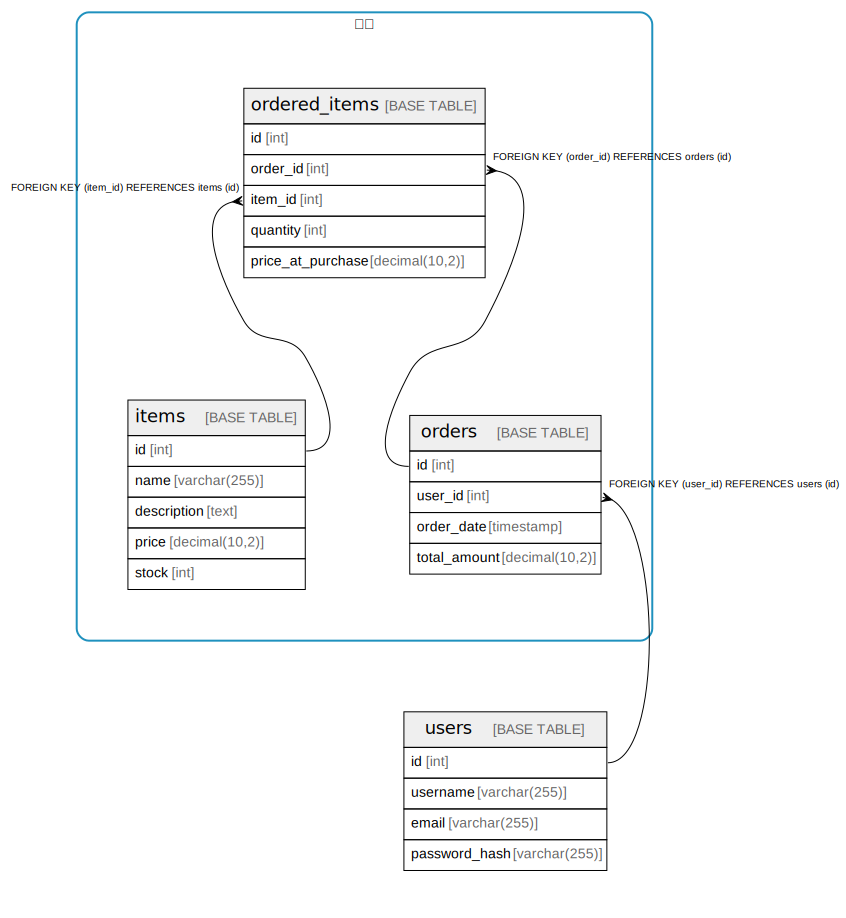

# 注文

## Description

注文した商品

## Tables

### 注文

注文した商品

| Name | Columns | Comment | Type |
| ---- | ------- | ------- | ---- |
| [items](items.md) | 5 |  | BASE TABLE |
| [ordered_items](ordered_items.md) | 5 |  | BASE TABLE |
| [orders](orders.md) | 4 |  | BASE TABLE |

### -

| Name | Columns | Comment | Type |
| ---- | ------- | ------- | ---- |
| [users](users.md) | 4 |  | BASE TABLE |

## Relations

---

> Generated by [tbls](https://github.com/k1LoW/tbls)
